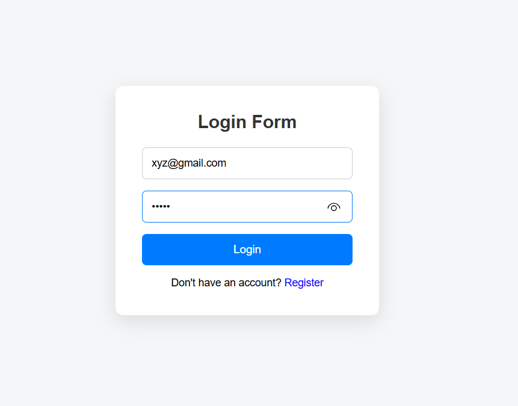
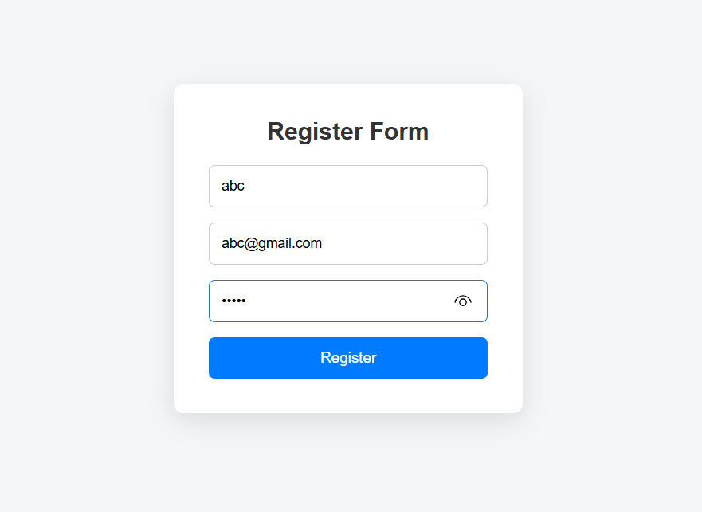
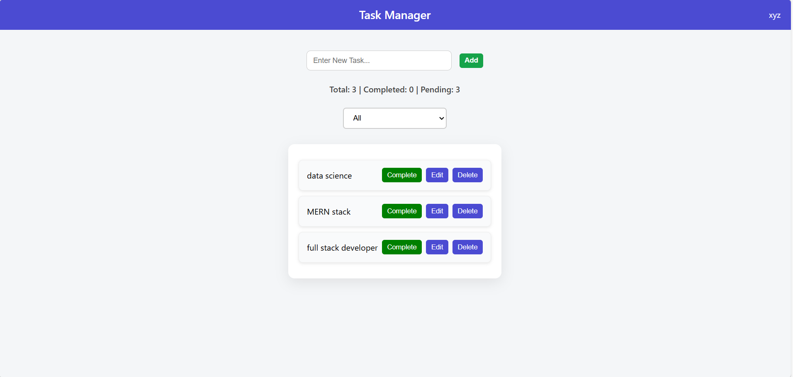

# Secure Task Manager

A full-stack MERN application that allows users to securely register, login, and manage their tasks.
This project demonstrates authentication, protected routes, and CRUD operations.

---

## 🚀 Features

* User Registration
* Secure Login Authentication (JWT)
* Protected Dashboard
* Create Tasks
* View Tasks
* Update Task Status
* Delete Tasks

---

## 🛠 Tech Stack

### Frontend

* React.js
* CSS

### Backend

* Node.js
* Express.js

### Database

* MongoDB

### Authentication

* JWT (JSON Web Token)

---

## 📂 Project Structure

```
SecureTaskManager
│
├── backend
│   ├── controllers
│   ├── routes
│   ├── models
│   └── server.js
│
├── frontend
│   ├── src
│   └── components
│
├── Screenshots
│   ├── login.png
│   ├── register.png
│   └── task.png
│
└── README.md
```

---

## ⚙ Installation

Clone the repository

```
git clone https://github.com/Maheswari-21/SecureTaskManager.git
```

Go to project folder

```
cd SecureTaskManager
```

Install backend dependencies

```
cd backend
npm install
```

Install frontend dependencies

```
cd ../frontend
npm install
```

Run the backend

```
npm start
```

Run the frontend

```
npm start
```

---

## 🌐 Application URL

```
http://localhost:3000
```

---

## 📸 Screenshots

### Login Page

<p align="center">
  
</p>

### Register Page

<p align="center">
  
</p>

### Task Dashboard

<p align="center">
  
</p>

---

## 🔐 Authentication Flow

1. User registers an account
2. User logs in
3. JWT token generated
4. Token used to access protected routes

---

## 👩‍💻 Author

Maheswari

GitHub: https://github.com/Maheswari-21
